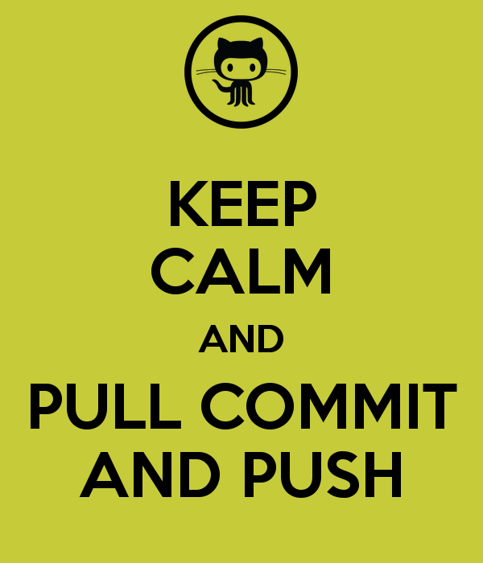

# UCT_hons_proj 2017 (Updated 21 April 2017)

## Terms of use
### *This is my personal collection of work, summaries and journal articles. I thus do ask, that if you use this material, that we have a mutual agreement you do not distribute the code too freely. If you enjoy the books that are here, I would encourage you to buy a hardcopy - its always nice to have the physical copy to work from*.

## Deadlines

Do note, although these are the official deadlines as laid out by the University, I would advise that you send the required material through earlier. The idea being that I have five students to supervise and if you give me enough time to review your document, you will receive a thorough review back.

* Project proposal (9 May 2017)
* Literature review (12 June 2017)
* Draft (11 September 2017)
* Final Feedback (16 October)
* Final submission (6 November 2017)

## Role of supervisor

After initial meeting, I will be less hands on for the project. What I mean by this is, I am the supervisor, not the person writing the project for you. Here is my promise to you

* I wil turn up for appointments if professionally organised
* Write to check up on a regular basis on all as deadlines approach
* Help with grammar and spelling as best I can
* Will inform you when I am not available (this WILL also be on this github page)
* Add anything interesting I find

## Role of student

* Be honest on the work you have done/that needs to be done
* Deliver a high standard of work as I will do my best to do the same
* Regular check-ins just to update supervisor
* Ask if you need help - but have to present an extensive effort and write up of 
    - what you have tried
    - what is working
    - what is not working
    - why you think it is not working
    - possible solution to your problem
* Reserve me the right to point you to google if I can copy paste the error/problem in google and its on the first page

## Folder structure

I have divided up the folder in three structures

* General readings, reference textbooks and time series fundamentals that you all should be familiar with
 * [Readings on forecasting](Readings - Forecasting)
 * [Readings on Techincal Trading](Readings - TC)
 
# And Remember...
 

